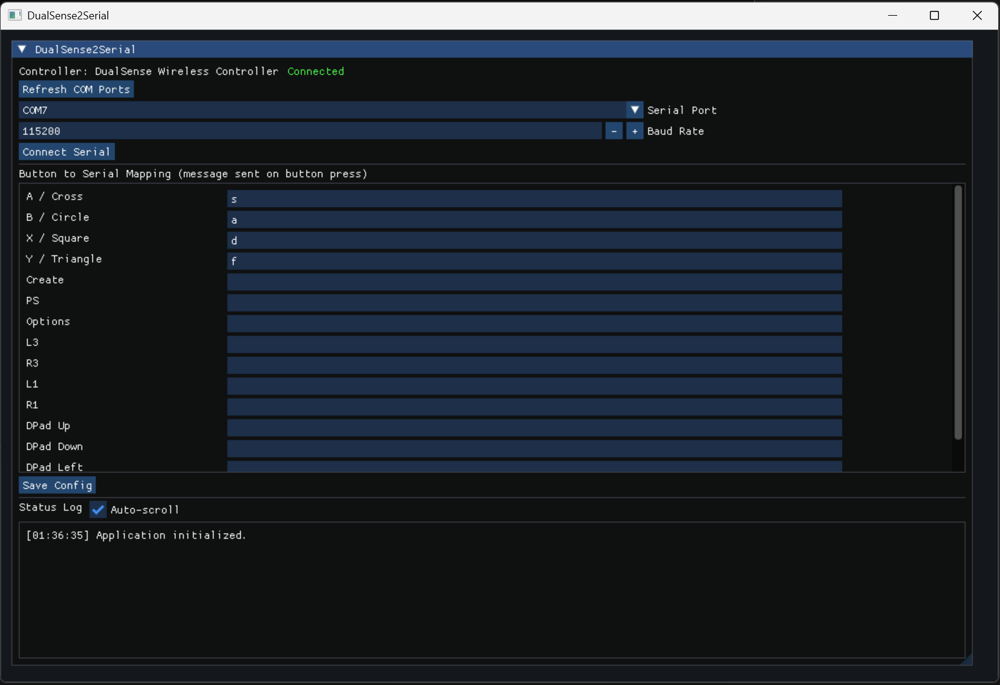

# DualSense2Serial

A native C++ desktop app that maps Sony DualSense button presses to serial messages.



## Features

- DualSense input through SDL2 (works with Bluetooth and USB when the controller is paired/connected in Windows).
- GUI mapping editor (Dear ImGui).
- COM port selection and baud-rate control.
- Sends line-based serial output (`message\\n`) when mapped buttons are pressed.
- JSON config save/load.

## Build (Windows)

### Prerequisites

- CMake 3.23+
- Visual Studio 2022 (or Build Tools with MSVC)
- Internet access during first configure/build (FetchContent downloads SDL2, Dear ImGui, and nlohmann/json)

### Commands

```powershell
cmake -S . -B build -G "Visual Studio 17 2022"
cmake --build build --config Release
```

### Run

```powershell
.\build\Release\DualSense2Serial.exe
```

## Notes

- Pair the DualSense in Windows Bluetooth settings before launching the app.
- SDL exposes PlayStation controls with Xbox-style names in many cases:
  - `A / Cross`, `B / Circle`, `X / Square`, `Y / Triangle`.
- Config file path is `config/dualsense2serial.json` relative to the working directory.
